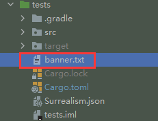

# Surrealism

- author：syf20020816@outlook.com
- docName：Surrealism README
- createDate：20230506
- updateDate：20230604
- version：0.0.1
- des-tag：test
- email：syf20020816@outlook.com

## Surrealism Introduction


Surrealism依托于Surrealdb提供的Rust官方标准库:surrealdb,目的是构建一种更加统一，简单的方式对Surrealdb数据库进行各类操作

Surrealism relies on Surrealdb's official Rust standard library:surrealdb,The purpose is to build a more unified and simple way to perform various operations on Surrealdb database

## QuickStart

### add dependencies

```toml
[dependencies]
surrealism = {path="../../surrealism"}
tokio = { version = "1.28.0", features = ["macros", "rt-multi-thread"] }
surrealdb = "1.0.0-beta.9"
serde = { version = "1.0.162", features = ["derive"] }
```

### add configuration
配置：
- surreal:单机本地连接Single还是分布式连接Multi
- username:用户名
- password:密码
- url:连接地址
- port:连接端口
- mode:连接模式（Memory:表示内存,File:表示存到文件中）
- path:存储到文件中的文件地址，使用Memory设置为""即可
- logLevel:日志级别(error,warn,info,debug,trace)

可采用JSON或TOML两种配置文件方式

设置配置文件地址可以是：
- ./Surrealism.toml
- ./configs/Surrealism.toml
- ./templates/Surrealism.toml

<hr>

configuration：

- surreal:Single machine local connection or distributed connection Multi
- username:your username
- password:your password
- url:connection url
- port:connection port
- mode:connection mode（Memory:Instructions for storing in memory,File:Instructions stored in files）
- path:The file address stored in the file can be set to "" using Memory
- logLevel:log level(error,warn,info,debug,trace)

Two configuration file methods can be used: JSON or TOML

The configuration file address can be set to：

- ./Surrealism.toml
- ./configs/Surrealism.toml
- ./templates/Surrealism.toml

#### Surrealism.json(JSON)
```json
{
  "surreal": "Single",
  "username": "root",
  "password": "syf20020816",
  "url": "127.0.0.1",
  "port": "10086",
  "mode": "Memory",
  "path": "E:/Rust/surreal",
  "logLevel": "info"
}
```
#### Surrealism.toml(TOML)
```toml
[default]
surreal = "Single"
username = "root"
password = "syf20020816"
url = "127.0.0.1"
port = "10086"
mode = "Memory"
path = "E:/Rust/surreal"
logLevel="info"
```

### main.rs

```rust
use surrealism::{InitServiceImpl, SurrealRes};

#[tokio::main]
async fn main() -> SurrealRes<()> {
    ///初始化连接
    ///init connection
    let db = InitServiceImpl::new().init().unwrap();
    Ok(())
}

```

### terminal res

```bash
   ▄▄▄▄                                                      ▄▄▄▄         ██
 ▄█▀▀▀▀█                                                     ▀▀██         ▀▀
 ██▄       ██    ██   ██▄████   ██▄████   ▄████▄    ▄█████▄    ██       ████     ▄▄█████▄  ████▄██▄
  ▀████▄   ██    ██   ██▀       ██▀      ██▄▄▄▄██   ▀ ▄▄▄██    ██         ██     ██▄▄▄▄ ▀  ██ ██ ██
      ▀██  ██    ██   ██        ██       ██▀▀▀▀▀▀  ▄██▀▀▀██    ██         ██      ▀▀▀▀██▄  ██ ██ ██
 █▄▄▄▄▄█▀  ██▄▄▄███   ██        ██       ▀██▄▄▄▄█  ██▄▄▄███    ██▄▄▄   ▄▄▄██▄▄▄  █▄▄▄▄▄██  ██ ██ ██
  ▀▀▀▀▀     ▀▀▀▀ ▀▀   ▀▀        ▀▀         ▀▀▀▀▀    ▀▀▀▀ ▀▀     ▀▀▀▀   ▀▀▀▀▀▀▀▀   ▀▀▀▀▀▀   ▀▀ ▀▀ ▀▀

2023-05-28T08:41:12.568Z INFO  [surrealism::creator::services::init_service] Configuration Initialization over(配置初始化完成)
2023-05-28T08:41:12.568Z INFO  [surrealism::creator::services::init_service] Connection Initialization start(初始化连接检测开始)
2023-05-28T08:41:12.579Z INFO  [surrealism::creator::services::init_service] Version {
    router: Ok(
        Router {
            conn: PhantomData<surrealdb::api::engine::remote::ws::Client>,
            sender: Sender,
            last_id: 2,
            features: {
                Auth,
            },
        },
    ),
}
2023-05-28T08:41:12.609Z INFO  [surrealism::creator::services::init_service] Connection Initialization over , Pay attention to checking the connection detection information above(初始化连接检测结束,注意查看上方连接检测信息)
```

## Add your Logo！

我们可以在根目录中添加banner.txt来添加自己的Logo

We can add banner.txt to the root directory to add our own logo



### banner.txt

```
             ,        ,
            /(_,    ,_)\
            \ _/    \_ /
            //        \\
            \\ (@)(@) //
             \'="=="='/
         ,===/        \===,
        ",===\        /===,"
        " ,==='------'===, "
         "                "

```

## UseWrapper

> UseWrapper的作用是：帮助我们构建使用命名空间和数据库
>
> UseWrapper：Help us build and use namespaces and databases

### function

| fun name | params:type     | return          | des                                                          |
| -------- | --------------- | --------------- | ------------------------------------------------------------ |
| use_ns   | namespace: &str | &mut UseWrapper | 设置SurrealDB使用的命名空间<br />Set the namespace used by SurrealDB |
| use_db   | database: &str  | &mut UseWrapper | 设置SurrealDB使用的数据库<br />Set up the database used by SurrealDB |

### Import

如果你想使用`UseWrapper`，你必须从`surrealism`导入`UseWrpper`和`Wrapper`

If you wanna use `UseWrapper` , you must import `UseWrapper` and `Wrapper` from `surrealism`

```rust
use surrealism::{UseWrapper, Wrapper};
```

### main.rs

```rust
use surrealism::{InitServiceImpl, SurrealRes, UseWrapper, Wrapper};

#[tokio::main]
async fn main() -> SurrealRes<()> {
    ///初始化连接
    ///init connection
    let db = InitServiceImpl::new().init().unwrap();
    ///创建UseWrapper
    /// new UseWrapper
    let mut use_wrapper = UseWrapper::new();
    /// 设置命名空间和数据库
    /// Set namespace and database
    use_wrapper.use_ns("test").use_db("test");
    /// 提交语句
    /// commit statement
    let res_use = db.use_commit(use_wrapper).await;
    dbg!(res_use);
    Ok(())
}
```

### res

```bash
[src\main.rs:38] res_use = Ok(
    (),
)
```

## CreateWrapper

> CreateWrapper的作用：帮助我们构造Create语句
>
> CreateWrapper：Help us construct the Create statement

### function

| fun name      | params:type                                            | return             | des                                                          |
| ------------- | ------------------------------------------------------ | ------------------ | ------------------------------------------------------------ |
| create        | table_name: &str                                       | &mut CreateWrapper | 创建表名称<br />create table name                            |
| id            | table_id: `TableId<T>`                                 | &mut CreateWrapper | 创建表的ID , ID使用TableId进行构建!<br />create table with id , use TableId enum to create! |
| set           | 1. field_name: &str<br />2. value: T(`<T: Serialize>`) | &mut CreateWrapper | SET方式构建字段<br />SET method for constructing fields      |
| content       | content_obj: T (`<T: Serialize`)                       | &mut CreateWrapper | CONTENT方式构建字段<br />CONTENT method for constructing fields |
| return_none   |                                                        | &mut CreateWrapper | 返回NONE<br />RETURN NONE                                    |
| return_diff   |                                                        | &mut CreateWrapper | 返回DIFF<br />RETURN DIFF                                    |
| return_before |                                                        | &mut CreateWrapper | 返回BEFORE<br />RETURN BEFORE                                |
| return_after  |                                                        | &mut CreateWrapper | 返回AFTER<br />RETURN AFTER                                  |
| return_field  | field_name: &str                                       | &mut CreateWrapper | 返回某个字段<br />Return a certain field                     |

### Import

#### set statement

如果你想使用`CreateWrapper`，你必须从`surrealism`导入`CreateWrapper`，`Wrapper`，`TableId`

If you wanna use `CreateWrapper` , you must import `CreateWrapper` ，`Wrapper` ，`TableId`from `surrealism`

```rust
use surrealism::{Wrapper, CreateWrapper, TableId};
```

#### content statement

如果使用content语句来构建则需要从`surrealism`导入`Wrapper, CreateWrapper, TableId`和`serde`中的`Serialize, Deserialize`

If using the content statement to build, it needs to be imported：`Wrapper, CreateWrapper, TableId` import`Serialize, Deserialize`from serde

```
use surrealism::{Wrapper, CreateWrapper, TableId};
use serde::{Serialize, Deserialize};
```

### use SET

让我使用CreateWrapper构建如下语句（Let me use CreateWrapper to build the following statement）：

`CREATE user:t10086 SET name='Jack',userId='jack001' RETURN NONE;`

#### main.rs

```rust
use surrealism::{InitServiceImpl, SurrealRes, UseWrapper, Wrapper, CreateWrapper, TableId};

#[tokio::main]
async fn main() -> SurrealRes<()> {
    ///初始化连接
    ///init connection
    let db = InitServiceImpl::new().init().unwrap();
    ///创建UseWrapper
    /// new UseWrapper
    let mut use_wrapper = UseWrapper::new();
    /// 设置命名空间和数据库
    /// Set namespace and database
    use_wrapper.use_ns("test").use_db("test");
    /// 提交语句
    /// commit statement
    let res_use = db.use_commit(use_wrapper).await;
    dbg!(res_use);
    ///创建CreateWrapper
    /// new CreateWrapper
    let mut create_wrapper = CreateWrapper::new();
    /// 设置构建语句
    /// set create statement
    /// CREATE user:t10086 SET name='Jack',userId='jack001' RETURN NONE;
    create_wrapper.create("user")
        .id(TableId::<String>::Str("t10086".to_string()))
        .set("name", "Jack")
        .set("userId", "jack001")
        .return_none();
    /// 提交语句
    /// commit statement
    let create_res = db.commit(create_wrapper).await;
    dbg!(create_res.unwrap());
    Ok(())
}
```

#### res

```bash
[src\main.rs:33] create_res.unwrap() = Response(
    {
        0: Ok(
            [],
        ),
    },
)

```

### use CONTENT

让我使用CreateWrapper构建如下语句（Let me use CreateWrapper to build the following statement）：

`CREATE user:t10088 CONTENT {userId:'mark001',name:'Mark',email:'mark@outlook.com'} RETURN AFTER;`

#### main.rs

```rust
use surrealism::{InitServiceImpl, SurrealRes, UseWrapper, Wrapper, CreateWrapper, TableId};
use serde::{Serialize, Deserialize};

///构建结构体,需要使用serde提供的宏:Serialize, Deserialize
/// build struct,Need to use the macro provided by serde::{Serialize, Deserialize}
#[derive(Debug, Serialize, Deserialize)]
struct User {
    pub userId: String,
    pub name: String,
    pub email: String,
}

#[tokio::main]
async fn main() -> SurrealRes<()> {
    ///初始化连接
    ///init connection
    let db = InitServiceImpl::new().init().unwrap();
    ///创建UseWrapper
    /// new UseWrapper
    let mut use_wrapper = UseWrapper::new();
    /// 设置命名空间和数据库
    /// Set namespace and database
    use_wrapper.use_ns("test").use_db("test");
    /// 提交语句
    /// commit statement
    let res_use = db.use_commit(use_wrapper).await;
    dbg!(res_use);
    ///创建CreateWrapper
    /// new CreateWrapper
    let mut create_wrapper = CreateWrapper::new();
    /// 设置构建语句
    /// set create statement
    /// CREATE user:t10088 CONTENT {userId:'mark001',name:'Mark',email:'mark@outlook.com'} RETURN AFTER;
    create_wrapper.create("user")
        .id(TableId::<String>::Str("t10088".to_string()))
        .content(User {
            userId: String::from("mark001"),
            name: String::from("Mark"),
            email: String::from("mark@outlook.com"),
        })
        .return_after();
    /// 提交语句
    /// commit statement
    let create_res = db.commit(create_wrapper).await;
    dbg!(create_res.unwrap());
    Ok(())
}
```

#### res

```bash
[src\main.rs:51] create_res.unwrap() = Response(
    {
        0: Ok(
            [
                Object(
                    Object(
                        {
                            "email": Strand(
                                Strand(
                                    "mark@outlook.com",
                                ),
                            ),
                            "id": Thing(
                                Thing {
                                    tb: "user",
                                    id: String(
                                        "t10088",
                                    ),
                                },
                            ),
                            "name": Strand(
                                Strand(
                                    "Mark",
                                ),
                            ),
                            "userId": Strand(
                                Strand(
                                    "mark001",
                                ),
                            ),
                        },
                    ),
                ),
            ],
        ),
    },
)

```


## SelectWrapper

> SelectWrapper的作用：帮助我们构造Select语句
>
> SelectWrapper：Help us construct the Select statement

### function

| fun name        | params:type                            | return          | des                                                          |
| --------------- | -------------------------------------- | --------------- | ------------------------------------------------------------ |
| select          | query: &str                            | &mut UseWrapper | 通用查询，需要自己写SQL语句<br />Universal query, requires writing SQL statements yourself |
| select_fields   | field: &Field                          | &mut UseWrapper | 设置查询字段<br />Set select fields                          |
| select_field    | fields: `&Vec<Field>`                  | &mut UseWrapper | 设置单个查询字段<br />Set select field （use `"*"` means select * from ...） |
| from            | table_name: &str                       | &mut UseWrapper | 设置查询的表<br />set table name which you wanna select      |
| where_condition | condition: &Criteria                   | &mut UseWrapper | 构建where子句<br />build a where statement                   |
| order_by        | conditions: `&mut Vec<OrderCondition>` | &mut UseWrapper | 构建OrderBy子句<br />build an OrderBy statement              |
| group_by        | conditions: &Vec<&str>                 | &mut UseWrapper | 构建GroupBy子句<br />build a GroupBy statement               |
| split_at        | conditions: &Vec<&str>                 | &mut UseWrapper | 构建SplitAt子句<br />build a SplitAt statement               |
| fetch           | fields: &Vec<&str>                     | &mut UseWrapper | 构建Fetch子句<br />build a Fetch statement                   |
| timeout         | 1. time: usize<br />2. unit: TimeUnit  | &mut UseWrapper | 构建延时Timeout子句<br />build a timeout statement           |
| limit_by        | pieces: usize                          | &mut UseWrapper | 构建limit子句<br />build an Limit statement                  |
| start_at        | pieces: usize                          | &mut UseWrapper | 构建Start子句<br />build a Start statement                   |

### Import

如果你想使用`SelectWrapper`，你必须从`surrealism`导入`SelectWrapper`和`Wrapper`

If you wanna use `SelectWrapper` , you must import `SelectWrapper` and `Wrapper` from `surrealism`

```rust
use surrealism::{Wrapper, SelectWrapper};
```

### select with whole statement

```rust
use surrealism::{InitServiceImpl, SurrealRes, UseWrapper, Wrapper, SelectWrapper};

#[tokio::main]
async fn main() -> SurrealRes<()> {
    ///初始化连接
    ///init connection
    let db = InitServiceImpl::new().init().unwrap();
    ///创建UseWrapper
    /// new UseWrapper
    let mut use_wrapper = UseWrapper::new();
    /// 设置命名空间和数据库
    /// Set namespace and database
    use_wrapper.use_ns("test").use_db("test");
    /// 提交语句
    /// commit statement
    let res_use = db.use_commit(use_wrapper).await;
    dbg!(res_use);
    /// 最简单的查询也是最复杂的查询,需要自己手写SQL语句
    /// 用于构建一些SelectWrapper目前做不到的查询
    /// 例如:SELECT count() AS total, math::sum(age), gender, country FROM person GROUP BY gender, country;
    /// The simplest and most complex queries require handwritten SQL statements
    /// Used to build queries that SelectWrapper currently cannot perform
    /// example:SELECT count() AS total, math::sum(age), gender, country FROM person GROUP BY gender, country;
    let mut select_wrapper = SelectWrapper::new();
    select_wrapper.select("SELECT * FROM user");
    /// 提交语句
    /// commit statement
    let create_res = db.commit(select_wrapper).await;
    dbg!(create_res.unwrap());
    Ok(())
}
```

### res

```bash
[src\main.rs:49] create_res.unwrap() = Response(
    {
        0: Ok(
            [
                Object(
                    Object(
                        {
                            "id": Thing(
                                Thing {
                                    tb: "user",
                                    id: String(
                                        "t10086",
                                    ),
                                },
                            ),
                            "name": Strand(
                                Strand(
                                    "Jack",
                                ),
                            ),
                            "userId": Strand(
                                Strand(
                                    "jack001",
                                ),
                            ),
                        },
                    ),
                ),
                Object(
                    Object(
                        {
                            "id": Thing(
                                Thing {
                                    tb: "user",
                                    id: String(
                                        "t10087",
                                    ),
                                },
                            ),
                            "name": Strand(
                                Strand(
                                    "Rose",
                                ),
                            ),
                            "userId": Strand(
                                Strand(
                                    "rose001",
                                ),
                            ),
                        },
                    ),
                ),
                Object(
                    Object(
                        {
                            "email": Strand(
                                Strand(
                                    "mark@outlook.com",
                                ),
                            ),
                            "id": Thing(
                                Thing {
                                    tb: "user",
                                    id: String(
                                        "t10088",
                                    ),
                                },
                            ),
                            "name": Strand(
                                Strand(
                                    "Mark",
                                ),
                            ),
                            "userId": Strand(
                                Strand(
                                    "mark001",
                                ),
                            ),
                        },
                    ),
                ),
            ],
        ),
    },
)

```

### common use

#### main.rs

```rust
use surrealism::{InitServiceImpl, SurrealRes, UseWrapper, Wrapper, SelectWrapper, Field, Criteria};


#[tokio::main]
async fn main() -> SurrealRes<()> {
    ///初始化连接
    ///init connection
    let db = InitServiceImpl::new().init().unwrap();
    ///创建UseWrapper
    /// new UseWrapper
    let mut use_wrapper = UseWrapper::new();
    /// 设置命名空间和数据库
    /// Set namespace and database
    use_wrapper.use_ns("test").use_db("test");
    /// 提交语句
    /// commit statement
    let res_use = db.use_commit(use_wrapper).await;
    dbg!(res_use);
    ///准备查询条件
    /// prepare select conditions
    let mut field1 = Field::new("userId");
    field1.as_name("stuId");
    let field2 = Field::new("name");
    let fields = vec![field1, field2];
    let mut condition = Criteria::new();
    condition.eq("name", "'Rose'");

    /// 构建SelectWrapper
    /// SELECT userId AS stuId , name FROM user WHERE name = 'Rose' ;
    let mut select_wrapper = SelectWrapper::new();
    select_wrapper.select_fields(&fields)
        .from("user")
        .where_condition(&condition);

    /// 提交语句
    /// commit statement
    let create_res = db.commit(select_wrapper).await;
    dbg!(create_res.unwrap());
    Ok(())
}
```

#### res

```bash
[src\main.rs:57] create_res.unwrap() = Response(
    {
        0: Ok(
            [
                Object(
                    Object(
                        {
                            "name": Strand(
                                Strand(
                                    "Rose",
                                ),
                            ),
                            "stuId": Strand(
                                Strand(
                                    "rose001",
                                ),
                            ),
                        },
                    ),
                ),
            ],
        ),
    },
)

```

### more example

import `use surrealism::{OrderCondition, Ordered,TimeUnit}`

```rust
    let mut f_v = Vec::new();
    let mut f1 = Field::new("userId");
    f1.as_name("stuID");
    let mut f2 = Field::new("name");
    f2.as_name("stuName");
    f_v.push(f1);
    f_v.push(f2);
    let mut cri = Criteria::new();
    cri.gte(&cri.and(&cri.or(&cri.and("a", "b"), "c"), "d"), "12345");
    let handles = vec!["userId", "name"];
    let mut order_handles = Vec::new();
    let mut order_handle1 = OrderCondition::new_no_args();
    order_handle1.field("name").ordered(Ordered::DESC);
    let mut order_handle2 = OrderCondition::new_no_args();
    order_handle2.field("userId").ordered(Ordered::ASC);
    order_handles.push(order_handle1);
    order_handles.push(order_handle2);
    //查询
    queryWrapper.select_fields(&f_v)
        .from("user")
        .where_condition(&cri)
        .group_by(&handles)
        .split_at(&handles)
        .order_by(&mut order_handles)
        .start_at(15)
        .limit_by(30)
        .fetch(&vec!["user.name"])
        .timeout(50, TimeUnit::SECOND);
```

## InsertWrapper

> InsertWrapper的作用：帮助我们构造Insert语句
>
> InsertWrapper：Help us construct the Insert statement

### function

| fun name    | params:type              | return             | des                                                          |
| ----------- | ------------------------ | ------------------ | ------------------------------------------------------------ |
| insert_into | table_name: &str         | &mut InsertWrapper | 设置插入的表名<br />Set the inserted table name              |
| set         | key: &str<br /> value: T | &mut InsertWrapper | 插入单条记录单个字段<br />Insert a single record, a single field |
| insert_one  | obj: &T                  | &mut InsertWrapper | 使用非传统方式插入单条<br />Inserting a single record using non-traditional methods |
| insert_many | objs: `&Vec<T>`          | &mut InsertWrapper | 使用非传统方式插入多条<br />Inserting multiple records using non-traditional methods |
| insert      | stmt: &str               | &mut InsertWrapper | 通用插入自己写插入语句<br />Universal Insert Write Insert Statement on Your Own |

### Import

如果你想使用`InsertWrapper`，你必须从`surrealism`导入`InsertWrapper`和`Wrapper`

If you wanna use `InsertWrapper` , you must import `InsertWrapper` and `Wrapper` from `surrealism`

```rust
use surrealism::{Wrapper, InsertWrapper};
```

### Insert with traditional method (easy)

通过传统形式插入一条记录

Insert a record through traditional form

#### main.rs

```rust
use surrealism::{InitServiceImpl, SurrealRes, Wrapper, InsertWrapper, UseWrapper};

#[tokio::main]
async fn main() -> SurrealRes<()> {
    ///初始化连接
    ///init connection
    let db = InitServiceImpl::new().init().unwrap();
    ///创建UseWrapper
    /// new UseWrapper
    let mut use_wrapper = UseWrapper::new();
    /// 设置命名空间和数据库
    /// Set namespace and database
    use_wrapper.use_ns("test").use_db("test");
    /// 提交语句
    /// commit statement
    let res_use = db.use_commit(use_wrapper).await;
    dbg!(res_use);
    /// 构建InsertWrapper
    /// 通过键值对形式构建传统语句
    /// Constructing Traditional Statements through Key Value Pairs
    /// INSERT INTO user ( name , userId , age ) VALUES ( 'Kaye' , 'kaye001' , 56 );
    let mut insert_wrapper = InsertWrapper::new();
    insert_wrapper
        .insert_into("user")
        .set("name", "Kaye")
        .set("userId", "kaye001")
        .set("age", 56);
    /// 提交语句
    /// commit statement
    let create_res = db.commit(insert_wrapper).await;
    dbg!(create_res);
    Ok(())
}
```

#### res

```bash
[src\main.rs:39] create_res = Ok(
    Response(
        {
            0: Ok(
                [
                    Object(
                        Object(
                            {
                                "age": Number(
                                    Int(
                                        56,
                                    ),
                                ),
                                "id": Thing(
                                    Thing {
                                        tb: "user",
                                        id: String(
                                            "reht5rqftwhljaon9cbb",
                                        ),
                                    },
                                ),
                                "name": Strand(
                                    Strand(
                                        "Kaye",
                                    ),
                                ),
                                "userId": Strand(
                                    Strand(
                                        "kaye001",
                                    ),
                                ),
                            },
                        ),
                    ),
                ],
            ),
        },
    ),
)

```

## DeleteWrapper

> DeleteWrapper的作用：帮助我们构造Delete语句
>
> DeleteWrapper：Help us construct the delete statement

### function

| fun name        | params:type            | return             | des                                                          |
| --------------- | ---------------------- | ------------------ | ------------------------------------------------------------ |
| from            | table_name: &str       | &mut DeleteWrapper | 设置删除的表名<br />Set the delete table name                |
| id              | table_id: `TableId<T>` | &mut DeleteWrapper | 设置要删除的表的ID<br />Set the ID of the table to be deleted |
| where_condition | condition: &Criteria   | &mut DeleteWrapper | 构建where子句<br />build a where statement                   |
| timeout         | unit: TimeUnit         | &mut DeleteWrapper | 构建延时Timeout子句<br />build a timeout statement           |
| delete          | stmt: &str             | &mut DeleteWrapper | 通用插入自己写插入语句<br />Universal Insert Write Insert Statement on Your Own |
| return_none     |                        | &mut DeleteWrapper | 返回NONE<br />RETURN NONE                                    |
| return_diff     |                        | &mut DeleteWrapper | 返回DIFF<br />RETURN DIFF                                    |
| return_before   |                        | &mut DeleteWrapper | 返回BEFORE<br />RETURN BEFORE                                |
| return_after    |                        | &mut DeleteWrapper | 返回AFTER<br />RETURN AFTER                                  |
| return_field    | field_name: &str       | &mut DeleteWrapper | 返回某个字段<br />Return a certain field                     |

### Import

如果你想使用`DeleteWrapper`，你必须从`surrealism`导入`DeleteWrapper`和`Wrapper`

If you wanna use `DeleteWrapper` , you must import `DeleteWrapper` and `Wrapper` from `surrealism`

```rust
use surrealism::{Wrapper, DeleteWrapper};
```

### delete with define statement(easy)

#### main.rs

```rust
use surrealism::{InitServiceImpl, SurrealRes, Wrapper, DeleteWrapper, UseWrapper};

#[tokio::main]
async fn main() -> SurrealRes<()> {
    ///初始化连接
    ///init connection
    let db = InitServiceImpl::new().init().unwrap();
    ///创建UseWrapper
    /// new UseWrapper
    let mut use_wrapper = UseWrapper::new();
    /// 设置命名空间和数据库
    /// Set namespace and database
    use_wrapper.use_ns("test").use_db("test");
    /// 提交语句
    /// commit statement
    let res_use = db.use_commit(use_wrapper).await;
    dbg!(res_use);
    ///构建DeleteWrapper
    let mut delete_wrapper = DeleteWrapper::new();
    delete_wrapper.delete("DELETE user:t10086;");
    /// 提交语句
    /// commit statement
    let create_res = db.commit(delete_wrapper).await;
    dbg!(create_res.unwrap());
    Ok(())
}
```

#### res

```bash
[src\main.rs:39] create_res.unwrap() = Response(
    {
        0: Ok(
            [
                None,
            ],
        ),
    },
)

```

### delete easy

#### main.rs

```rust
use surrealism::{InitServiceImpl, SurrealRes, Wrapper, DeleteWrapper, UseWrapper, Criteria, TimeUnit, TableId};

#[tokio::main]
async fn main() -> SurrealRes<()> {
    ///初始化连接
    ///init connection
    let db = InitServiceImpl::new().init().unwrap();
    ///创建UseWrapper
    /// new UseWrapper
    let mut use_wrapper = UseWrapper::new();
    /// 设置命名空间和数据库
    /// Set namespace and database
    use_wrapper.use_ns("test").use_db("test");
    /// 提交语句
    /// commit statement
    let res_use = db.use_commit(use_wrapper).await;
    dbg!(res_use);
    /// 构建条件
    let mut condition = Criteria::new();
    condition.lt("age", "26");
    ///构建DeleteWrapper
    /// DELETE  user:2incz3ad74jlza71m0jq RETURN AFTER;
    let mut delete_wrapper = DeleteWrapper::new();
    delete_wrapper
        .from("user")
        .id(TableId::<String>::Str("2incz3ad74jlza71m0jq".to_string()))
        .return_after();
    /// 提交语句
    /// commit statement
    let create_res = db.commit(delete_wrapper).await;
    dbg!(create_res.unwrap());
    Ok(())
}
```

#### more examples

```rust
use surrealism::{InitServiceImpl, SurrealRes, Wrapper, DeleteWrapper, UseWrapper, Criteria, TimeUnit, TableId};
    ///构建DeleteWrapper
    /// DELETE  user:10086 WHERE age  <  26 RETURN AFTER TIMEOUT 5s;
    let mut delete_wrapper = DeleteWrapper::new();
    delete_wrapper
        .from("user:10086")
        .where_condition(&condition)
        .return_after()
        .timeout(5, TimeUnit::SECOND);
```

## UpdateWrapper

> UpdateWrapper的作用：帮助我们构造Update语句
>
> UpdateWrapper：Help us construct the Update statement

### function

| fun name        | params:type                                                  | return             | des                                                          |
| --------------- | ------------------------------------------------------------ | ------------------ | ------------------------------------------------------------ |
| from            | table_name: &str                                             | &mut UpdateWrapper | 设置更新的表名<br />Set the update table name                |
| id              | table_id: `TableId<T>`                                       | &mut UpdateWrapper | 设置要更新的表的ID<br />Set the ID of the table to be updated |
| set             | 1. field_name: &'static str<br /> 2. value: T`(<T: Serialize>)` | &mut UpdateWrapper | SET方式构建字段 <br />SET method for constructing fields     |
| content         | content_obj: T `(<T: Serialize>)`                            | &mut UpdateWrapper | CONTENT方式构建字段<br />CONTENT method for constructing fields |
| merge           | 1. key:&str<br />2. value:T`(<T: Serialize>)`                | &mut UpdateWrapper | 将新的文档合并到旧文档中,如果旧文档中存在相同的字段，则用新文档中相应字段的值来覆盖旧文档中的值。<br />Merge the new document into the old document, and if the same fields exist in the old document, overwrite the values in the old document with the values of the corresponding fields in the new document. |
| patch(不启用)   | value: &str                                                  | &mut UpdateWrapper | 用 JSON patch 的方式更新文档<br />Updating documents using JSON patches |
| where_condition | condition: &Criteria                                         | &mut UpdateWrapper | 构建where子句<br />build a where statement                   |
| timeout         | unit: TimeUnit                                               | &mut UpdateWrapper | 构建延时Timeout子句<br />build a timeout statement           |
| update          | stmt: &str                                                   | &mut UpdateWrapper | 通用更新,自己写语句<br />Universal Update, Write Update Statement on Your Own |
| return_none     |                                                              | &mut UpdateWrapper | 返回NONE<br />RETURN NONE                                    |
| return_diff     |                                                              | &mut UpdateWrapper | 返回DIFF<br />RETURN DIFF                                    |
| return_before   |                                                              | &mut UpdateWrapper | 返回BEFORE<br />RETURN BEFORE                                |
| return_after    |                                                              | &mut UpdateWrapper | 返回AFTER<br />RETURN AFTER                                  |
| return_field    | field_name: &str                                             | &mut UpdateWrapper | 返回某个字段<br />Return a certain field                     |

### Import

如果你想使用`UpdateWrapper`，你必须从`surrealism`导入`UpdateWrapper`和`Wrapper`

If you wanna use `UpdateWrapper` , you must import `UpdateWrapper` and `Wrapper` from `surrealism`

```rust
use surrealism::{Wrapper, UpdateWrapper};
```

### update with SET

#### main.rs

```rust
use surrealism::{InitServiceImpl, SurrealRes, Wrapper, UpdateWrapper, UseWrapper,TableId, CreateWrapper};

#[tokio::main]
async fn main() -> SurrealRes<()> {
    ///初始化连接
    ///init connection
    let db = InitServiceImpl::new().init().unwrap();
    ///创建UseWrapper
    /// new UseWrapper
    let mut use_wrapper = UseWrapper::new();
    /// 设置命名空间和数据库
    /// Set namespace and database
    use_wrapper.use_ns("test").use_db("test");
    /// 提交语句
    /// commit statement
    let res_use = db.use_commit(use_wrapper).await;
    dbg!(res_use);
    /// 准备数据
    /// prepare data
    let mut create_wrapper = CreateWrapper::new();
    create_wrapper.create("user")
        .id(TableId::<String>::Str("1008".to_string()))
        .set("name", "Kanye")
        .set("age", 36)
        .return_none();
    let create_res = db.commit(create_wrapper).await;
    dbg!(create_res);
    /// 构建UpdateWrapper
    /// UPDATE user:1008 SET age = 6 RETURN AFTER;
    let mut update_wrapper = UpdateWrapper::new();
    update_wrapper
        .from("user")
        .id(TableId::<String>::Str("1008".to_string()))
        .set("age", 6)
        .return_after();
    /// 提交语句
    /// commit statement
    let update_res = db.commit(update_wrapper).await;
    dbg!(update_res.unwrap());
    Ok(())
}
```

#### res

```bash
[src\main.rs:47] update_res.unwrap() = Response(
    {
        0: Ok(
            [
                Object(
                    Object(
                        {
                            "age": Number(
                                Int(
                                    6,
                                ),
                            ),
                            "id": Thing(
                                Thing {
                                    tb: "user",
                                    id: Number(
                                        1008,
                                    ),
                                },
                            ),
                            "name": Strand(
                                Strand(
                                    "Kanye",
                                ),
                            ),
                        },
                    ),
                ),
            ],
        ),
    },
)

```

### update with CONTENT

#### main.rs

```rust
use surrealism::{InitServiceImpl, SurrealRes, Wrapper, UpdateWrapper, UseWrapper, TableId};
use serde::{Serialize, Deserialize};

///构建结构体,需要使用serde提供的宏:Serialize, Deserialize
/// build struct,Need to use the macro provided by serde::{Serialize, Deserialize}
#[derive(Debug, Serialize, Deserialize)]
struct User {
    pub name: String,
    pub age: usize,
}

#[tokio::main]
async fn main() -> SurrealRes<()> {
    ///初始化连接
    ///init connection
    let db = InitServiceImpl::new().init().unwrap();
    ///创建UseWrapper
    /// new UseWrapper
    let mut use_wrapper = UseWrapper::new();
    /// 设置命名空间和数据库
    /// Set namespace and database
    use_wrapper.use_ns("test").use_db("test");
    /// 提交语句
    /// commit statement
    let res_use = db.use_commit(use_wrapper).await;
    dbg!(res_use);
    /// 准备数据
    /// prepare data
    let data = User {
        name: "Mask".to_string(),
        age: 16,
    };
    /// 构建UpdateWrapper
    /// UPDATE user:1008 CONTENT {name:'Mask',age:16} RETURN AFTER;
    let mut update_wrapper = UpdateWrapper::new();
    update_wrapper
        .from("user")
        .id(TableId::<String>::Str("1008".to_string()))
        .content(&data)
        .return_after();
    /// 提交语句
    /// commit statement
    let update_res = db.commit(update_wrapper).await;
    dbg!(update_res.unwrap());
    Ok(())
}
```

#### res

```bash
[src\main.rs:53] update_res.unwrap() = Response(
    {
        0: Ok(
            [
                Object(
                    Object(
                        {
                            "age": Number(
                                Int(
                                    16,
                                ),
                            ),
                            "id": Thing(
                                Thing {
                                    tb: "user",
                                    id: Number(
                                        1008,
                                    ),
                                },
                            ),
                            "name": Strand(
                                Strand(
                                    "Mask",
                                ),
                            ),
                        },
                    ),
                ),
            ],
        ),
    },
)

```

### update with MERGE

#### main.rs

```rust
use surrealism::{InitServiceImpl, SurrealRes, Wrapper, UpdateWrapper, UseWrapper, TableId};

#[tokio::main]
async fn main() -> SurrealRes<()> {
    ///初始化连接
    ///init connection
    let db = InitServiceImpl::new().init().unwrap();
    ///创建UseWrapper
    /// new UseWrapper
    let mut use_wrapper = UseWrapper::new();
    /// 设置命名空间和数据库
    /// Set namespace and database
    use_wrapper.use_ns("test").use_db("test");
    /// 提交语句
    /// commit statement
    let res_use = db.use_commit(use_wrapper).await;
    dbg!(res_use);
    /// 构建UpdateWrapper
    /// UPDATE user:1008 MERGE { name:'StuWie' , age:3 } RETURN AFTER;
    let mut update_wrapper = UpdateWrapper::new();
    update_wrapper
        .from("user")
        .id(TableId::<String>::Str("1008".to_string()))
        .merge("name", "StuWie")
        .merge("age",3)
        .return_after();

    /// 提交语句
    /// commit statement
    let update_res = db.commit(update_wrapper).await;
    dbg!(update_res.unwrap());
    Ok(())
}
```

#### res

```bash
[src\main.rs:49] update_res.unwrap() = Response(
    {
        0: Ok(
            [
                Object(
                    Object(
                        {
                            "age": Number(
                                Int(
                                    3,
                                ),
                            ),
                            "id": Thing(
                                Thing {
                                    tb: "user",
                                    id: Number(
                                        1008,
                                    ),
                                },
                            ),
                            "name": Strand(
                                Strand(
                                    "StuWie",
                                ),
                            ),
                        },
                    ),
                ),
            ],
        ),
    },
)

```

